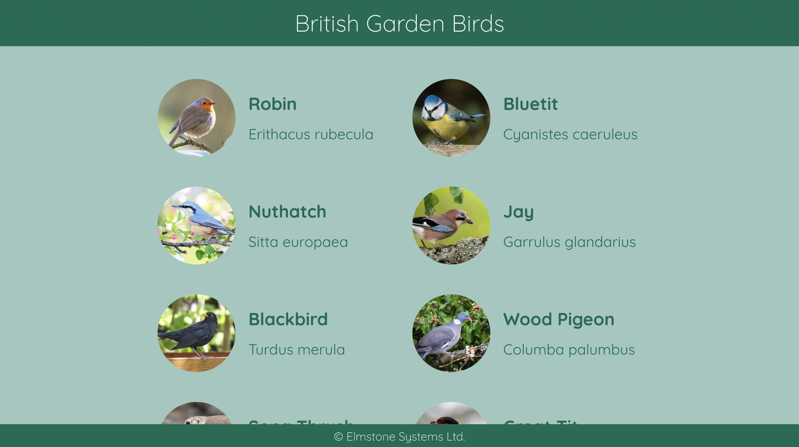

#### Bird API

The /birds route needs changing to return the bird data from public/data.json in alphabetical order.

Complete the route, and create a unit test using any test framework.

Create a website with Create-React-App in typescript to display the birds as shown below. The site should be coded with function components and css / scss modules. The header and footer should both be sticky.

